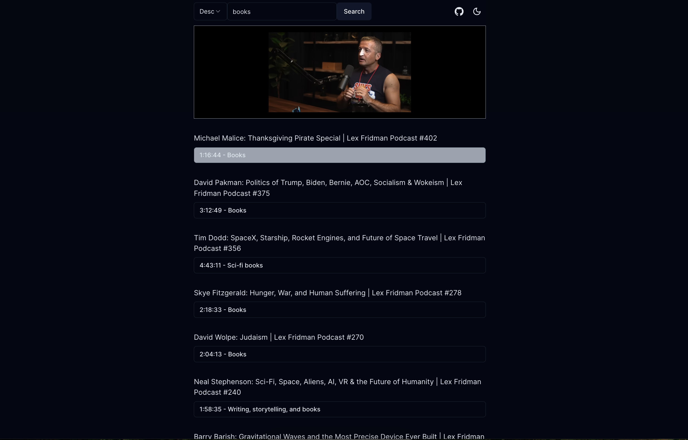

## Lex Fridman Podcast Search

Easily and distraction-free search through and watch all chapters in the [Lex Fridman podcast](https://www.youtube.com/@lexfridman).

As a big fan of the podcast, I just want to be able to watch and jump around the chapters in different episodes or search for specific topics.

Live app: https://lexpodcast.vercel.app/



## Tech Stack

- [Nestjs](https://github.com/nestjs/nest)
- [Apollo GraphQL](https://www.apollographql.com/docs/)
- [Prisma](https://www.prisma.io/)
- [MySQL](https://www.mysql.com/)
- [Redis](https://redis.io/)
- [Frontend Repo](https://github.com/buikhacnam/lex-fridman-podcast-search-chapter-app)
## Development

### Prerequisites
- Node.js
- MySQL

### Run Locally

copy `.env.example` to `.env` and fill in the values

```bash
cp .env.example .env
```

install dependencies

```bash
yarn
```

initialize database

```bash
yarn prisma migrate dev
```

start the server

```bash
yarn start:dev
```

### Retrieve Podcast Data

```graphql
mutation PodcastCron {
    podcastCron
}
```

### License
MIT License